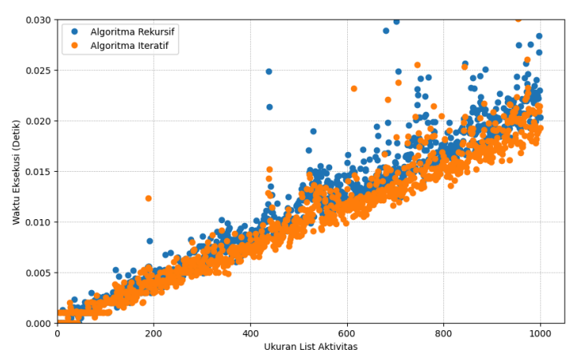
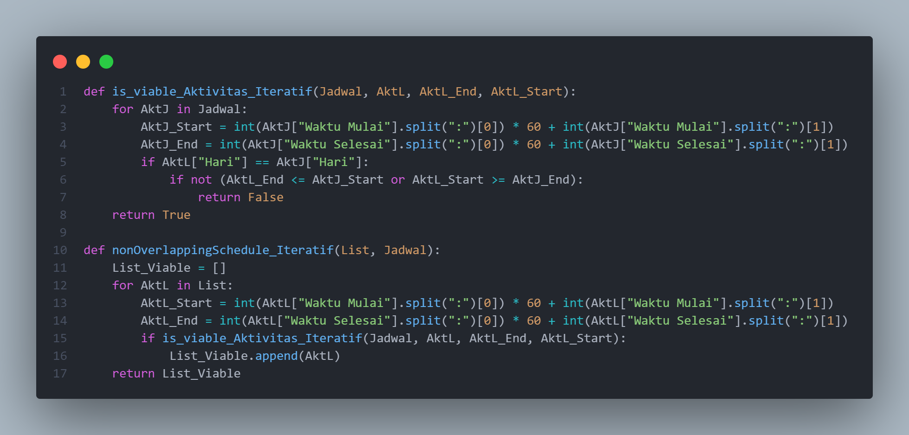

# 🗓️ nonOverlapping\_Schedule

## 📚 Tugas Besar Analisis Kompleksitas Algoritma

Proyek ini membandingkan dua pendekatan algoritma—**rekursif** dan **iteratif**—untuk menyelesaikan masalah *activity selection* (penjadwalan aktivitas non-overlapping) berdasarkan kompleksitas waktu dan performa eksekusi.

---

## ⚙️ Deskripsi Eksperimen

* Kedua algoritma diuji menggunakan **list aktivitas yang dihasilkan secara acak**.
* Evaluasi dilakukan berdasarkan **waktu eksekusi** dan **kompleksitas waktu teoretis**.
* Walaupun aktivitas di-*generate* secara acak, hasil pengujian menunjukkan pola yang konsisten antara **jumlah aktivitas** dan **waktu eksekusi**.

---

## 📈 Hasil & Analisis Eksperimen

Hasil perbandingan kompleksitas Algoritma Iteratif dan Rekursif

Hasil perbandingan kompleksitas Algoritma Iteratif Kuadratik dan Linear

---

## 🧠 Analisis Kompleksitas Teoretis

### 🔁 Algoritma Rekursif: `nonOverlappingSchedule_Rekursif`

---

### 🔄 Algoritma Iteratif: `nonOverlappingSchedule_Iteratif`

---

## 📊 Kesimpulan

✅ **Iteratif lebih unggul** dalam hal efisiensi waktu saat skala input meningkat.\
✅ **Keduanya setara** dalam kompleksitas teoritis, namun **praktik menunjukkan keunggulan iteratif** dalam efisiensi eksekusi.\
✅ Analisis kompleksitas mendukung hasil eksperimen: iteratif lebih stabil dan scalable.

---

## 📈 Poster

Poster Rifqi
[Poster Rifqi](Poster/Poster_Rifqi.pdf)

Poster Fathan
[Poster Fathan](Poster/Poster_Fathan.pdf)
